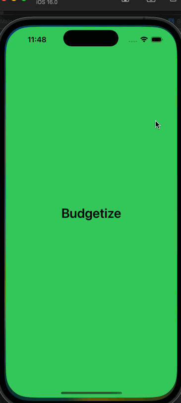

# Budgetize

## Table of Contents
1. [Overview](#Overview)
2. [Build Progress](#Build-Progress)
3. [Product Spec](#Product-Spec)
4. [Wireframes](#Wireframes)
5. [Schema](#Schema)
6. Project Board: https://github.com/orgs/Budgetize/projects/1


## Overview
### Description
Managing money is vital to sustaining one's livelihood. Using this app makes tracking daily transactions and ensuring that you are staying within your budget easier than ever!

### App Evaluation
- **Category:** Financial Independence 
- **Mobile:** This app focuses on targeting individuals that need easy access to their daily spending and want to calculate their budget for different aspects of their life (entertainment, car payments, etc).
- **Story:** Gather user financial spending and generate recommendations based on user settings and user data.
- **Market:** Any individual can use this app to help with their financial journey, but individuals seeking to make changes to their financial wellness would benefit the most.
- **Habit:** Every instance an individual earns or spends money presents an opporunity for the user to enter the information into the app. This information can then be used to reevaluate the amount the user can afford to pay for rent and/or car payments. The user can open the app and use it several times a day.
- **Scope:** Our app will get transaction information from the user, use some API's, and display the most relevant data for the user - that being the transaction history and potential/desired rent and car payments.

## Build Progress

### Sprint 4


### Sprint 3



### Sprint 2


### Sprint 1

Sprint 1 was cut really short because of the hurricane and extending deadlines from the last unit. We have all began our user stories on our own versions of the project and will be meeting to combine them to this repository.


## Product Spec

### 1. User Stories (Required and Optional)

**Required Must-have Stories**

- [x]	Create repository so all developers can work on it 
- [x]	Create Parse and share the information between team members
- [x]	Users will be introduced to a launch screen with app branding
- [x]	User can create a new account 
- [x]	User can login 
- [x]	Users can see an aesthetically pleasing login/register screen 
- [x]	Users can see a mock-up consistent transaction history page
- [x]	User will be notified if that username does not exist
- [x]	User will be notified if that username/password is incorrect
- [x]	User can select start date
- [x] User can select end date
- [ ]	User can view all transactions
- [ ]	User can see a financial overview 
- [ ]	User can add expenses
- [ ]	User can add income
- [ ] User can add expense details
- [ ]	User can add income details
- [ ]	User can view all transactions
- [x]	App branding (Ongoing) (icons, introduction icon) need be created/gathered

**Optional Nice-to-have Stories**

* User can save an expense for later
* User can save an income for later

### 2. Screen Archetypes

* Login/Register
   * A selectable button that allows the user to switch between registering and logging in.
   * Logging in leads them to the transaction history page.
* Transaction History Page
   * Displays the information for the users transaction history. This includes deposits, withdraws, purchases, transfers, or anything the user wants! It also allows users to delete a specific transaction.
   * The navigation section will include an add page button that will allow the user to go to the transaction add page.
* Income Add Page
   * Allows users to add income to their account so they may view an aggregate view in the transaction history page.
   * The navigation will allow the user to go back to the previous screen.
* Expense Add Page
   * Allows users to add expenses to their account so they may view an aggregate view in the transaction history page.
   * The navigation will allow the user to go back to the previous screen. 

### 3. Navigation

**Tab Navigation** (Tab to Screen)

* Add income page
* Add expense page
* Transaction history page
* Logout

**Flow Navigation** (Screen to Screen)

* Login -> Register page or transaction history page
* Transaction history page -> Back to login page or to add income page or add expense page
* Add income page -> Back to transaction history page
* Add expense page -> Back to transaction history page

## Wireframes


[PDF form](Wireframe%20Sketch.pdf)

### [BONUS] Digital Wireframes & Mockups

Above

### [BONUS] Interactive Prototype

## Schema 
### Models

### *User*

  | Property | Type | Description|
|---------|---------| ---------| 
| ObjectID | String | UniqueID |
| Username | String | Username of the user |
| Password | String | Password of the user |
| Expenses | List of Expenses | A list of the user’s expenses |
| Incomes | List of Incomes | A list of the user’s incomes |

### *Expense*

  | Property | Type | Description|
|---------|---------| ---------| 
| ObjectID | String | UniqueID |
| Author | User | Author of expense |
| PayTo | String | Who/what was this expense to |
| Memo | String | An optional personal note of the expense |
| Amount | Number (Double) | The USD Dollar amount of the expense |
| Date | Date | A date object of the expense (mm/DD/yy) |

### *Income*

  | Property | Type | Description|
|---------|---------| ---------| 
| ObjectID | String | UniqueID |
| Author | User | Author of income |
| Source | String | Where the income came from |
| Memo | String | An optional personal note of the income |
| Amount | Number (Double) | The USD Dollar amount of the income |
| Date | Date | A date object of the income (mm/DD/yy) |

### Networking
- Login/Register
  - (POST) Login user
    ```swift
    PFUser.logInWithUsername(inBackground: username.text!, password: password.text!) {(user, error) in
        if user != nil {
            self.performSegue(withIdentifier: "loginSeque", sender: nil)
        } else {
            print("Error: \(error?.localizedDescription ?? "OH NO")")
        }
    }
    ```
  - (POST) Register user
    ```swift
    let user = PFUser()
    user.username = username.text
    user.password = password.text
    user.signUpInBackground {(success, error) in
        if success {
            self.performSegue(withIdentifier: "loginSeque", sender: nil)
        } else {
            print("Error \(error?.localizedDescription ?? "OH NO")")
        }
    }
    ```
- Transaction History Page
  - (GET) Query all transactions (incomes/expenses)
    ```swift
    let query = PFQuery(className: "TransactionHistory")
    query.includeKeys(["expenses", "incomes"])
    query.limit = 100
    query.findObjectsInBackground {(transactionHistory, error) in
        if (transactionHistory != nil) {
            self.transactionHistory = transactionHistory!
            self.tableView.reloadData()
        } else {
            print ("Error: \(error?.localizedDescription ?? "NO")")
        }
    }
    ```
  - (DELETE) Remove a expense from history
    ```swift
    let query = PFQuery(className: "Expenses")
    query.whereKey("ObjectID", equalTo: expenseID)
    query.findObjectsInBackgroundWithBlock {
    (objects: [AnyObject]?, error: NSError?) -> Void in
        for object in objects {
            object.deleteEventually()
        }
    }
    ```
  - (DELETE) Remove an income from history
    ```swift
    let query = PFQuery(className: "Incomes")
    query.whereKey("ObjectID", equalTo: incomeID)
    query.findObjectsInBackgroundWithBlock {
    (objects: [AnyObject]?, error: NSError?) -> Void in
        for object in objects {
            object.deleteEventually()
        }
    }
    ```
- Income Add Page
  - (POST) Add a new income to the users account
    ```swift
    let income = PFObject(className: "Incomes")
    income["payto"] = payto
    income["memo"] = memo
    income["date"] = date
    income["author"] = PFUser.current()!
    PFUser.current()!.add(income, forKey: "incomes")
    PFUser.current()!.saveInBackground {(success, error) in
        if success {
            print("Income saved")
            self.tableView.reloadData()
        } else {
            print("Error \(error?.localizedDescription ?? "OH NO")")
        }
    }
    ```
- Expense Add Page
  - (POST) Add a new expense to the users account
    ```swift
    let expense = PFObject(className: "Expenses")
    expense["payto"] = payto
    expense["memo"] = memo
    expense["date"] = date
    expense["author"] = PFUser.current()!
    PFUser.current()!.add(expense, forKey: "expenses")
    PFUser.current()!.saveInBackground {(success, error) in
        if success {
            print("Expense saved")
            self.tableView.reloadData()
        } else {
            print("Error \(error?.localizedDescription ?? "OH NO")")
        }
    }
    ```
